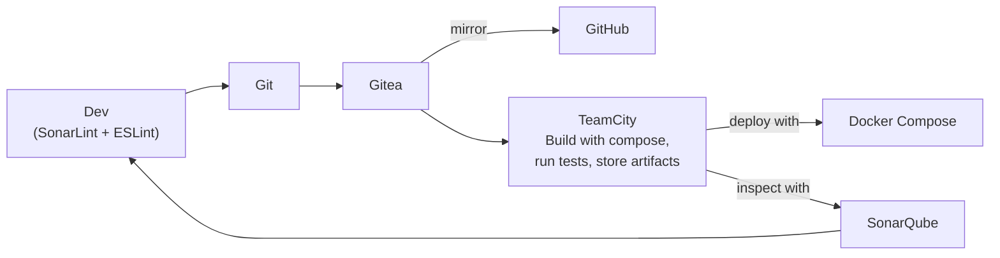

# Pipeline

## Overview

The CI/CD pipeline is built as follows:

```mermaid
graph LR
  dev["Dev<br/>(SonarLint + ESLint)"]
  git["Git"]
  gitea["Gitea"]
  github["GitHub"]

  teamcity["TeamCity<br/>Build with compose,<br/>run tests, store artifacts"]
  sonarqube["SonarQube"]

  docker-compose["Docker Compose"]

  dev --> git --> gitea -->|mirror| github
  gitea --> teamcity -->|deploy with| docker-compose
  teamcity -->|inspect with| sonarqube --> dev
```

<button type="button" class="custom-button" @click="fullscreen">Fullscreen</button>

