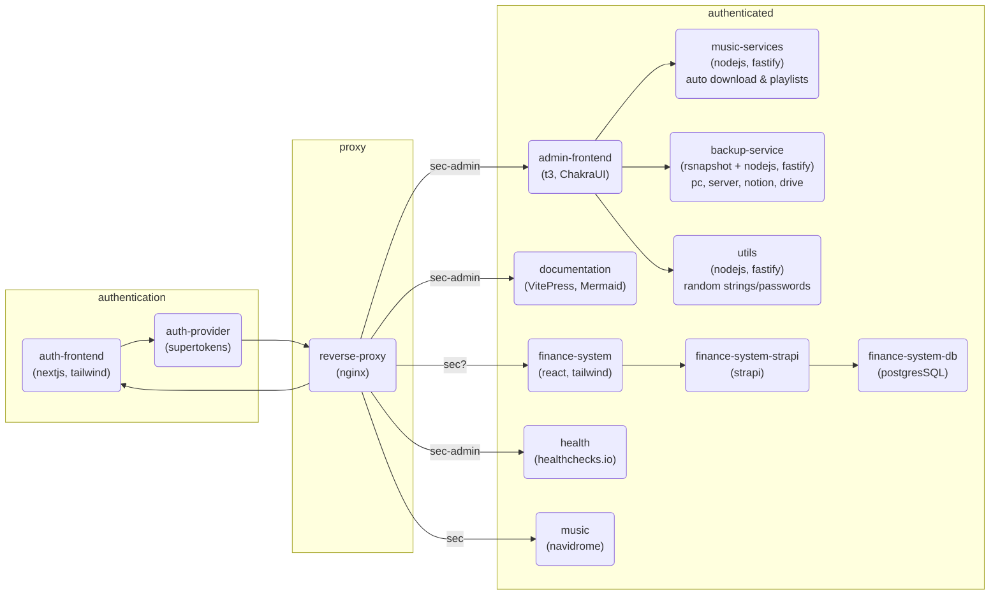

# Overview

This project contains multiple services:

<button type="button" class="custom-button" @click="fullscreen">Fullscreen</button>

## Structure

Each folder of the root directory contains a service, or it's configuration.
There won't be much documentation via `README` files because each service is or will be documented
here.

## Environment

The root directory contains a `.env.template` file which contains all possible environment
variables you can set. Specify them as you want inside the `.env` file.

In most cases there are three variables for each service:

- `{SERVICE}_CONTAINER_NAME={SERVICE}`
- `{SERVICE}_PORT=8080`
- `{SERVICE}_BASE_PATH=/{SERVICE}`

They are used to configure the services inside the docker compose configuration and reverse proxy
settings and for the service-containers themselves to avoid duplicated configurations.

## Docker Compose

This project is set up with `docker compose`. Docker compose is used for development, testing,
and deployment. The `docker-compose.yml` contains all the necessary configuration.

> :warning: Please notice, that since we are using a reverse proxy to reach services, ports (except of
> dev-containers) must not be exposed.

### Dev Containers

To develop inside containers, the service directories are mounted to the containers.
> :warning: The `node_modules` folder must always be a volumes (preferably an anonymous one)
> to prevent packages being incompatible with the system.

For more specific information about a service, please refer to the following service pages.

## .gitignore

The `.gitignore` file contains general exports for the whole project.
They are used in all subdirectories.
