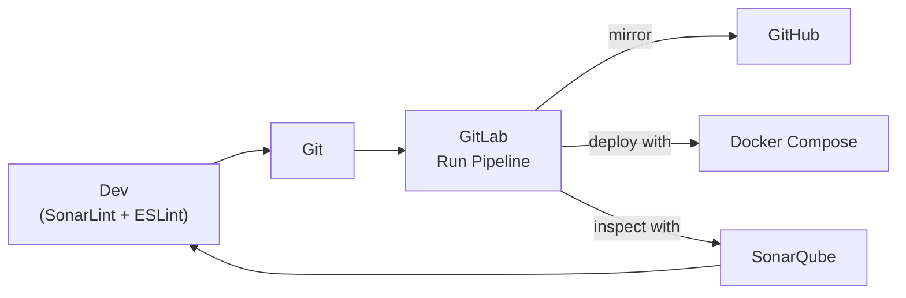

# Dev Setup

My setup looks like this:

```mermaid
graph LR
  dev["Dev<br/>(SonarLint + ESLint)"]
  git["Git"]
  github["GitHub"]

  gitlab["GitLab<br/>Run Pipeline"]
  sonarqube["SonarQube"]

  docker-compose["Docker Compose"]

  dev --> git --> gitlab -->|mirror| github
  gitlab -->|deploy with| docker-compose
  gitlab -->|inspect with| sonarqube --> dev
```

<button type="button" class="custom-button" @click="fullscreen">Fullscreen</button>

See the gitlab pipeline here: [gitlab-ci.yml](../.gitlab-ci.yml)
