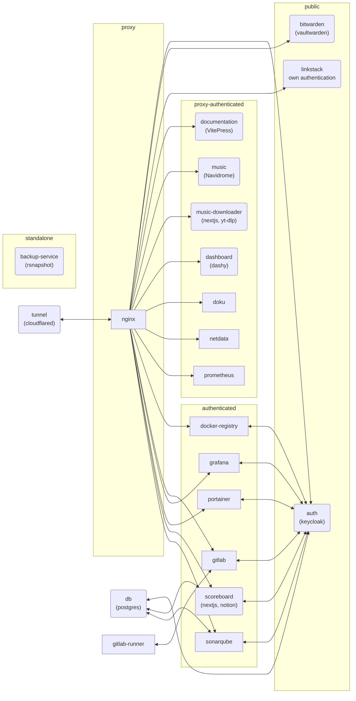

# Overview

This project contains multiple services:

<button type="button" class="custom-button" @click="fullscreen">Fullscreen</button>

## Environment

The root directory contains a `.env.template` file which contains all possible environment
variables you can set. Specify them as you want inside the `.env` file.

In most cases there are three variables for each service:

- `{SERVICE}_CONTAINER_NAME={SERVICE}`
- `{SERVICE}_PORT=8080`
- `{SERVICE}_BASE_PATH=/{SERVICE}`

They are used to configure the services inside the docker compose configuration and reverse proxy
settings and for the service-containers themselves to avoid duplicated configurations.

## Docker Compose

This project is set up with `docker compose`. Docker compose is used for development, testing,
and deployment. The `docker-compose.yml` contains all the necessary configuration.

> :warning: Please notice, that since we are using a reverse proxy to reach services, ports (except of
> dev-containers) must not be exposed.
